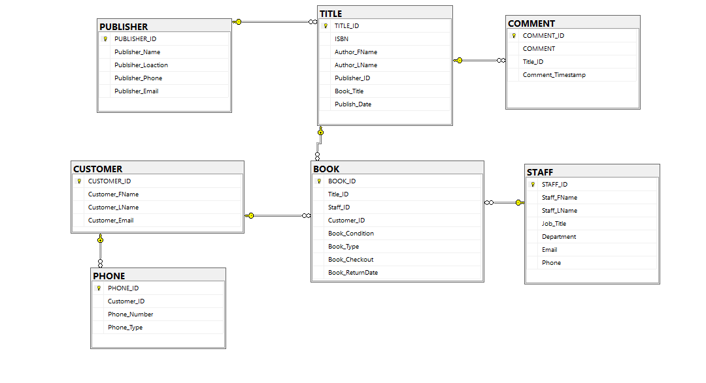

# Library Database Project

Built using a C# Windows Forms app and SSMS server for the backend, this purpose of this project was to create a database for the faculty and staff to share, donate, and checkout books.

## Database Diagram

